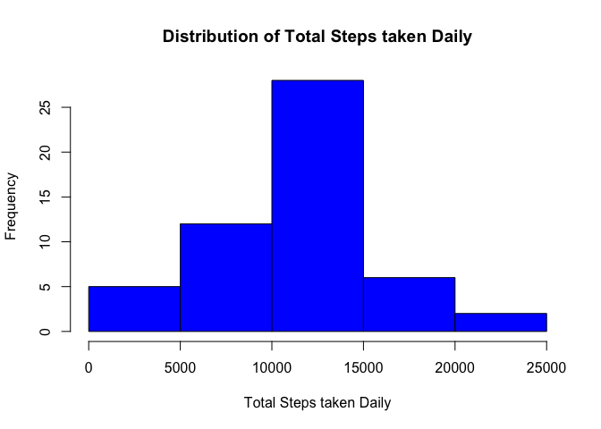
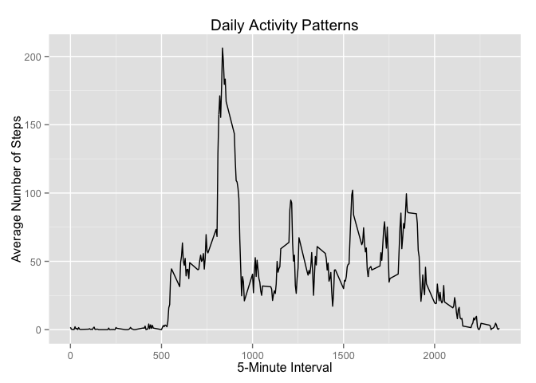
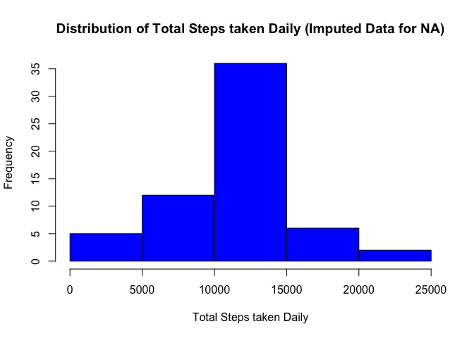
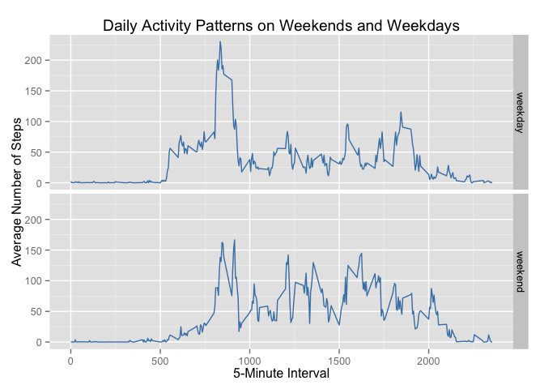

# Reproducible Research: Peer Assessment 1
Julie Repass

This report is the output from an assignment in the [Reproducible Research](https://www.coursera.org/course/repdata) class that is part of the [Data Science Specialization](https://www.coursera.org/specializations/jhudatascience) program from John Hopkins University offered through Coursera.  The assignment makes use of data from a personal activity monitoring device which collects data at 5 minute intervals through out the day. The data consists of two months of data from an anonymous individual collected during the months of October and November, 2012 and include the number of steps taken in 5 minute intervals each day.

## Loading and preprocessing the data

Below was the code used to load the data.  The code first unzips the data file if the .csv 
file is not already in the current directory, and then loads the activity.csv data into R
and stores it in the act_data variable.


```r
if (!file.exists("activity.csv")) {
        unzip("activity.zip")
}
act_data <- read.csv("activity.csv")
```

The only pre-processing done to prepare the data for analysis was to transform the "date" column class from a 'factor' to a 'date' class using the following code:


```r
act_data$date <- as.Date(act_data$date)
```

## What is mean total number of steps taken per day?

The first analysis done was to calculate the total number of steps taken per day and to create a histogram to plot their distribution over the study period. Note that the below code makes use of the *dplyr* R package which needs to be installed in the R environment as an available library. 


```r
library(dplyr)
act_data_2 <- summarize(group_by(act_data, date), tot_steps = sum(steps))
hist(act_data_2$tot_steps, col = "blue", 
     xlab = "Total Steps taken Daily", 
     ylab = "Frequency", 
     main = "Distribution of Total Steps taken Daily")
```

 

Next, the average and median was calculated for the total number of steps taken daily:


```r
avg_steps <- as.integer(round(mean(act_data_2$tot_steps, na.rm = TRUE)))
med_steps <- median(act_data_2$tot_steps, na.rm = TRUE)
```

The results report the mean total number of steps taken daily is **10766** and the median is **10765**.

## What is the average daily activity pattern?

To explore the average daily activity pattern, a time series plot was constructed of the 5-minute interval (x-axis) and the average number of steps taken, averaged across all days (y-axis). Note that the below code makes use of the *ggplot2* R package which needs to be installed in the R environment as an available library. 


```r
library(ggplot2)
act_data_3 <- summarize(group_by(act_data, interval), 
                        avg_steps = mean(steps, na.rm = TRUE))
qplot(interval, avg_steps, data= act_data_3, geom = "line", 
      xlab = "5-Minute Interval", 
      ylab = "Average Number of Steps",
      main = "Daily Activity Patterns"
      )
```

 

Next, the below code was used to calculate which 5-minute interval, on average across all the days in the dataset, contained the maximum number of steps:


```r
max_steps <- as.integer(round(max(act_data_3$avg_steps)))
max_interval_filter <- filter(act_data_3, round(avg_steps) == max_steps)
max_interval <- max_interval_filter$interval
```

The results determined that the 5-minute interval **835**, or between 8:35 and 8:40 AM, on average across all days in the dataset, had the maximum number of steps taken which was **206** steps.

## Imputing missing values

The dataset includes a number of days/intervals where there are missing values (coded as NA) which may introduce bias into some calculations or summaries of the data. The goal for this part of the analysis was to see how imputing the missing values affected the calculations and summaries computed in the previous sections. 
The first step was to calculate and report the total number of missing values in the dataset: 


```r
no_data <- is.na(act_data$steps)
cnt_na <- length(act_data$steps[no_data])
```

The result of this calculation determined there are **2304** missing values in the dataset.

Since there are full days with missing values, the strategy used to fill in the missing values was to use the average number of steps for that interval across all the days in the dataset calculated in the previous section in place of the 'NA' value. The below code implements this strategy and includes comments around each processing step:


```r
## Subset the dataset into two - one with all the rows with missing values and
## one with all the rows with complete data.
act_data_na <- filter(act_data, is.na(steps))
act_data_not_na <- filter(act_data, !is.na(steps))

## Merge average steps per interval data calculated across all days with the 
## NA subset
act_data_na <- merge(act_data_na, act_data_3)
new <- select(act_data_na, avg_steps, date, interval)

## Assign the average number of steps for the respective interval to the 
## 'steps' variable for each record containing a missing value for 'steps'.
new <- rename(new, steps = avg_steps)

## Rejoin all data and restore the original ordering of the rows and columns.
new_act_data <- rbind(act_data_not_na, new)
new_act_data <- arrange(new_act_data, date, interval)
```

The output from above is a new dataset that is equal to the original dataset but with the missing data filled in.  Using this new dataset, the histogram of the total number of steps taken each day was created again:


```r
new_act_data_2 <- summarize(group_by(new_act_data, date), tot_steps = sum(steps))
hist(new_act_data_2$tot_steps, col = "blue", xlab = "Total Steps taken Daily", 
    ylab = "Frequency", 
    main = "Distribution of Total Steps taken Daily (Imputed Data for NA)")
```

 

Next, the mean and median total number of steps taken per day was recalculated: 


```r
new_avg_steps <- as.integer(round(mean(new_act_data_2$tot_steps)))
new_med_steps <- as.integer(round(median(new_act_data_2$tot_steps)))
```

Using the new dataset, the results report the mean total number of steps taken daily is **10766** and the median is **10766**.

The only observable difference between the estimates of the total daily number of steps using the two datasets was with the median, which only increased by 1.  As a result, the impact of imputing missing data on the estimates of the total daily number of steps was found to be minimal.

## Are there differences in activity patterns between weekdays and weekends?

The last analysis performed used the dataset with the filled-in missing values to see if there were any observable differences in activity patterns between weekdays and weekends. 

The first step was to create a new factor variable in the dataset with two levels – “weekday” and “weekend” indicating whether a given date is a weekday or weekend day:


```r
new_act_data_3 <- mutate(new_act_data, day = weekdays(date),
                         day_cat = factor(1 * (day == "Saturday" | day == "Sunday"), 
                         labels = c("weekday", "weekend")))
new_act_data_3 <- select(new_act_data_3, -day)
```

Using the new factor variable created from running the above code, a panel plot was constructed containing a time series plot of the 5-minute interval (x-axis) and the average number of steps taken, averaged across all weekday days or weekend days (y-axis):


```r
library(plyr)
new_act_data_4 <- ddply(new_act_data_3, .(day_cat, interval), summarize, avg_steps = mean(steps))
g <- ggplot(new_act_data_4, aes(interval, avg_steps))
g + geom_line(col = "steelblue") + facet_grid(day_cat ~ .) + 
        labs(title = "Daily Activity Patterns on Weekends and Weekdays", 
             y = "Average Number of Steps", x = "5-Minute Interval") 
```

 

One can see that the same activity spike occurs around the same time in the morning, but on average it is higher on weekend days than on weekdays.  The spike is also more pronounced in the weekend data compared to averages for other hours across the day, whereas on weekdays there are similar spikes throughout the day that come close to the maximum spike observed during the weekday morning.
